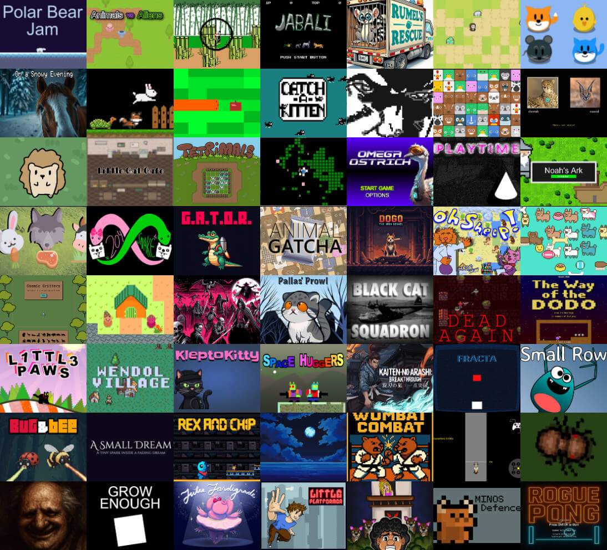

# LittleJS - The Tiny Fast JavaScript Game Engine

<div align='center'>
    


[![NPM Package][npm]][npm-url]
[![Build Size][build-size]][build-size-url]
[![NPM Downloads][npm-downloads]][npmtrends-url]
[![DeepScan][deepscan]][deepscan-url]
[![Discord][discord]][discord-url]

</div>

## 🚂 All Aboard!

LittleJS is a fast, lightweight, and fully open source HTML5 game engine designed for simplicity and performance.
Its small footprint is packed with a comprehensive feature set including rendering, physics, particles, sound, and input handling.
The code is very clean and well documented with many examples to get you started quickly.

### 🚀 Join the LittleJS Game Jam

*The Third Annual LittleJS Game Jam will take place From Oct 2 to Nov 2! Unleash your creativity and develop amazing games using the LittleJS game engine. 🕹️🎮 [Sign up today and get more info about the jam on itch.io!](https://itch.io/jam/littlejs-jam)*

<div align='center'>

## [Demos](https://killedbyapixel.github.io/LittleJS/examples) | [Docs](https://killedbyapixel.github.io/LittleJS/docs) | [Trailer](https://youtu.be/chuBzGjv7Ms) | [Discord](https://discord.gg/zb7hcGkyZe) | [FAQ](https://github.com/KilledByAPixel/LittleJS/blob/main/FAQ.md)

</div>


## LittleJS Features

### ✨ Graphics

- Blazing fast WebGL2 + Canvas2D hybrid rendering system
- Apply [Shadertoy](https://www.shadertoy.com) style shaders for post-processing effects
- Robust particle effect system and [effect design tool](https://killedbyapixel.github.io/LittleJS/examples/particles/)

### 🔊 Audio

- Sound and music with mp3, ogg, or wave files
- Use [ZzFX](https://killedbyapixel.github.io/ZzFX/) sound generator to play sounds without asset files
- Spatial audio stereo panning

### 🎮 Input

- Comprehensive input handling for mouse, keyboard, gamepad, and touch
- Customizable on screen gamepad designed for mobile devices

### 💥 Physics

- Robust arcade physics system with collision handling
- Fast tilemap collision and raycasting
- Full Box2D integration for realistic physics

### 🚀 Flexibility

- Compatible with all modern web browsers and mobile devices
- Full TypeScript and Module support with example projects for both
- Great for size coding competitions like [Js13kGames](https://js13kgames.com/)
- Open Source and [MIT licensed](https://github.com/KilledByAPixel/LittleJS/blob/main/LICENSE)

### 🛠️ Developer Tools

- Live example browser with code editor
- Import level editor data from [Tiled](https://github.com/mapeditor/tiled) or other JSON
- Debug overlay and primitive rendering system
- Medal tracking system with [Newgrounds](https://www.newgrounds.com/) support
- Node.js build system

## How To Use LittleJS

To get started download the latest LittleJS package from GitHub or install via npm: ```npm install littlejsengine```

- [Making Awesome Games With LittleJS](https://youtu.be/_dXKU0WgAj8?si=ZDXLYAFDWp54hrGT) - A short talk about LittleJS with some tips on how to use it.
- [Tutorial: Breakout](https://github.com/KilledByAPixel/LittleJS/tree/main/examples/breakoutTutorial) - Learn how to make a simple game from scratch
- [Tutorial: Make a ski game](https://eoinmcgrath.com/little-ski/tutorial.html) - This tutorial by eoinmcg that shows how to make a pixel art style game.
- [LittleJS Quick Reference Sheet](https://github.com/KilledByAPixel/LittleJS/blob/main/reference.md) - A reference sheet to help you get started.
- [Little JS FAQ](https://github.com/KilledByAPixel/LittleJS/blob/main/FAQ.md) - Answers to common questions about LittleJS.
- [JS13k Branch](https://github.com/KilledByAPixel/LittleJS/tree/js13k) - For size coding events like JS13k there is a special branch that builds to a 7KB zip.
- [LittleJS GPT AI](https://chatgpt.com/g/g-67c7c080b5bc81919736bc8815836be6-make-games-with-littlejs) - Use AI to make games without writing any code!
- [LittleJS AI Info](https://github.com/KilledByAPixel/LittleJS-AI) - Experiments, games, and templates to improve LittleJS + AI workflows.

## Examples

LittleJS comes with a several demos both for learning and using as starter projects to create new games.

- [Example Browser](https://killedbyapixel.github.io/LittleJS/examples/) - Live example browser with all examples
- [Breakout](https://killedbyapixel.github.io/LittleJS/examples/breakout/) - Block breaking game with post-processing effects
- [Puzzle Game](https://killedbyapixel.github.io/LittleJS/examples/puzzle/) - Match 3 puzzle game with HD rendering and high score tracking
- [Platformer](https://killedbyapixel.github.io/LittleJS/examples/platformer/) - Platformer/shooter demo that loads level data
- [Box2D Demo](https://killedbyapixel.github.io/LittleJS/examples/box2d/) - Box2D plugin demonstration and testbed
- [Stress Test](https://killedbyapixel.github.io/LittleJS/examples/stress/) - Sprite rendering benchmark and music system demo
- [Particle System Designer](https://killedbyapixel.github.io/LittleJS/examples/particles/) - Particle system editor and visualizer

## Builds

| File | Mode | Module | Use case |
|------|------|--------|----------|
| [littlejs.js](https://github.com/KilledByAPixel/LittleJS/blob/main/dist/littlejs.js) | Debug | No | Debug mode with asserts |
| [littlejs.release.js](https://github.com/KilledByAPixel/LittleJS/blob/main/dist/littlejs.release.js) | Release | No | Optimized for release |
| [littlejs.min.js](https://github.com/KilledByAPixel/LittleJS/blob/main/dist/littlejs.min.js) | Release | No | Optimized for release and minified |
| [littlejs.esm.js](https://github.com/KilledByAPixel/LittleJS/blob/main/dist/littlejs.esm.js) | Debug | ESM | Debug mode with asserts |
| [littlejs.esm.min.js](https://github.com/KilledByAPixel/LittleJS/blob/main/dist/littlejs.esm.min.js) | Release | ESM | Optimized for release and minified |

## Games Made With LittleJS

Here are a few of the many amazing games created with LittleJS...

- [Space Huggers](https://www.newgrounds.com/portal/view/819609) - Roguelike platformer shoot-em-up game with procedural levels. by [KilledByAPixel](https://frankforce.com/)
- [Black Cat Squadron](https://js13kgames.com/games/black-cat-squadron) - One button shooter based on a WW2 Navy squadron. JS13k 5th place! by [repsej](https://github.com/repsej)
- [L1ttl3 Paws](https://github.com/KilledByAPixel/JS13K2025) - Cat glider with procedural art and levels for JS13K! by [KilledByAPixel](https://frankforce.com/)
- [KleptoKitty](https://js13kgames.com/games/kleptokitty) - Cat themed heist puzzle. JS13K 22nd place. by [eoinmcg](https://eoinmcg.itch.io/)
- [The Way of the Dodo](https://js13kgames.com/2024/games/the-way-of-the-dodo) - Single button platformer. JS13k 5th place! by [repsej](https://github.com/repsej)
- [Undergrowth](https://undergrowth.squidband.uk/) - An interactive music videogame for the band Squid. by [KilledByAPixel](https://frankforce.com/)
- [204Snake!](https://www.newgrounds.com/portal/view/960100) - A puzzle game that combines 2048 with snake. LittleJS Jam 1st place! by [Sodoj](https://sodoj.itch.io/) and [Shai-P](https://shai-p.itch.io/)
- [GATOR](https://www.newgrounds.com/portal/view/960757) - Retro platformer shooter game where you rescue animals. LittleJS Jam 2nd place! by [eoinmcg](https://eoinmcg.itch.io/)
- [A Hedgehog's Search](https://willsm1111.itch.io/a-hedgehogs-search) - Adventure game starring a hedgehog. LittleJS Jam 3rd place! by [willsm1111](https://willsm1111.itch.io/)
- [Wendol Village](https://js13kgames.com/2024/games/wendol-village) - Warcraft inspired RTS game. by [sanojian](https://github.com/sanojian)
- [Dead Again](https://js13kgames.com/entries/dead-again) - Top down survival horror. by [sanojian & repsej](https://github.com/sanojian/js13k_2022)
- [Isletopia](https://store.steampowered.com/app/1861260/Isletopia) - Relaxing strategy game of greenifying barren islands. by [Gamex Studio](https://x.com/gamesgamex)
- [Tetrimals](https://nixn.itch.io/tetrimals) - A puzzle game mixing Tetris with animals. by [nixn](https://nixn.itch.io/)
- [Bug&Bee](https://itch.io/jam/littlejs-game-jam-2025/results) - Low fi shoot em up with co-op gameplay. LittleJS Jam 1st place! by [eoinmcg](https://eoinmcg.itch.io/)
- [Little Platformer](https://psemo.itch.io/little-platformer) - Platformer with many mechanics. LittleJS Jam 2st place! by [PSEMO](https://psemo.itch.io/), [Solita666](https://itch.io/profile/solita666), [GabrielRG](https://gabrielrg.itch.io/), [Nate](https://natesassoon.itch.io/)
- [Rogue Pong](https://itch.io/jam/littlejs-game-jam-2025/rate/4004165) - Roguelike crossed with classic pong gameplay. LittleJS Jam 3rd place! by [webdevbrian](https://webdevbrian.itch.io/)
- [LittleJS Jam 2024 Results](https://itch.io/jam/littlejs-jam-2024/results) - All the games from the first LittleJS Game Jam.
- [LittleJS Jam 2025 Results](https://itch.io/jam/littlejs-game-jam-2025/results) - All the games from the second LittleJS Game Jam.




[npm]: https://img.shields.io/npm/v/littlejsengine
[npm-url]: https://www.npmjs.com/package/littlejsengine
[build-size]: https://img.shields.io/bundlephobia/minzip/littlejsengine
[build-size-url]: https://bundlephobia.com/result?p=littlejsengine
[npm-downloads]: https://img.shields.io/npm/dw/littlejsengine
[npmtrends-url]: https://www.npmtrends.com/littlejsengine
[deepscan]: https://deepscan.io/api/teams/22950/projects/26229/branches/831487/badge/grade.svg
[deepscan-url]: https://deepscan.io/dashboard#view=project&tid=22950&pid=26229&bid=831487
[discord]: https://img.shields.io/discord/939926111469568050
[discord-url]: https://discord.gg/zb7hcGkyZe
