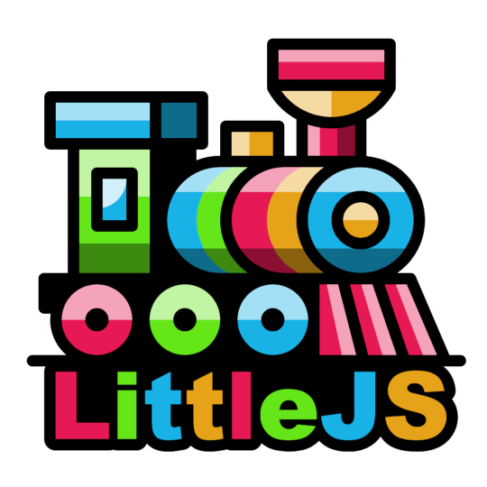
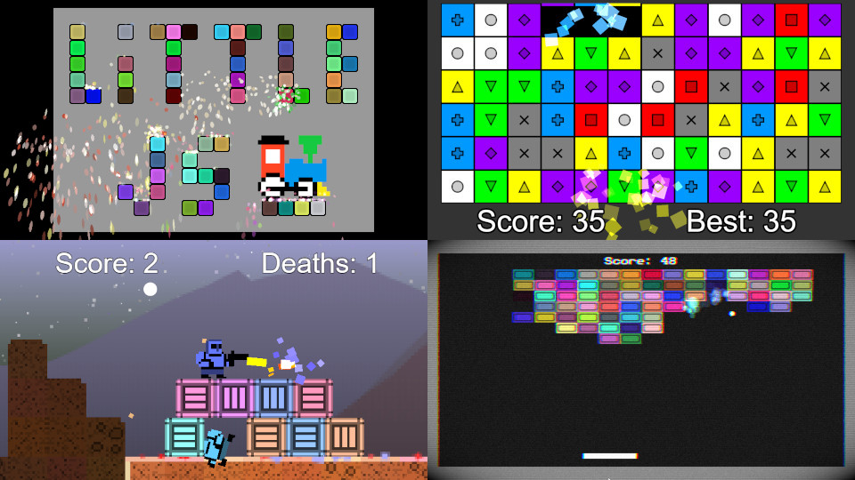

# LittleJS - The Tiny Fast JavaScript Game Engine

<div align="center">
    


[![NPM Package][npm]][npm-url]
[![Build Size][build-size]][build-size-url]
[![NPM Downloads][npm-downloads]][npmtrends-url]
[![DeepScan][deepscan]][deepscan-url]
[![Discord][discord]][discord-url]

</div>

## 🚂 All aboard!

LittleJS is a fast lightweight open source HTML5 game engine for modern web development.
Its small footprint is packed with a comprehensive feature set including hybrid rendering, physics, particles, sound effects, music, and input handling.
The code is very clean and well documented with some fun examples to get you started. Choo-Choo!

### 🚀 Join the First Ever LittleJS Game Jam

*The LittleJS Game Jam will take place From Nov 11 to Dec 12! Unleash your creativity and develop amazing games using the LittleJS game engine. 🕹️🎮 [Sign up today and get more info about the jam on itch.io!](https://itch.io/jam/littlejs-game-jam)*

<div align="center">

## [Demo](https://killedbyapixel.github.io/LittleJS/examples/starter/) | [Docs](https://killedbyapixel.github.io/LittleJS/docs) | [Trailer](https://youtu.be/chuBzGjv7Ms) | [Discord](https://discord.gg/zb7hcGkyZe) | [Tutorial](https://github.com/KilledByAPixel/LittleJS/blob/main/examples/breakoutTutorial/README.md) | [Quick Reference](https://github.com/KilledByAPixel/LittleJS/blob/main/reference.md)

</div>



## About LittleJS

LittleJS is a small but powerful game engine with many features and no dependencies.

### ✨ Graphics

- Super fast sprite and tile map rendering engine with WebGL
- Update and render 100,000+ sprites at a solid 60fps
- Apply [Shadertoy](https://www.shadertoy.com) compatible shaders for post-processing effects
- Robust particle effect system and [effect design tool](https://killedbyapixel.github.io/LittleJS/examples/particles/)

### 🔊 Audio

- Positional sound effects with wave files or ZzFX
- Use [ZzFX](https://killedbyapixel.github.io/ZzFX/) sound effect generator to play sounds without asset files
- Music with mp3, ogg, wave, or [ZzFXM](https://keithclark.github.io/ZzFXM/)

### 🎮 Input

- Comprehensive input handling for keyboard, mouse, gamepad, and touch
- On screen touch gamepad designed for mobile devices

### 💥 Physics

- Robust arcade physics system with collision handling
- Very fast collision and raycasting for tile maps
- Full Box2d support using [super fast wasm build of box2d.js](https://github.com/kripken/box2d.js/)

### 🚀 Flexibility

- Compatible with all modern web browsers and on mobile devices
- Support for TypeScript and Modules with example projects for both
- Ideal for size coding competitions like [js13kGames](https://js13kgames.com/), [starter project builds to a 7KB zip](https://killedbyapixel.github.io/LittleJS/examples/js13k)
- Builds to an executable with [Electron](https://www.electronjs.org/) for distribution on Windows, macOS, and Linux
- Open Source with the [MIT license](https://github.com/KilledByAPixel/LittleJS/blob/main/LICENSE) so it can be used for anything you want forever

### 🛠️ And more...

- Node.js build system
- 2D vector math library
- Debug primitive rendering system
- Particle effects system and design tool
- Bitmap font rendering and includes a built in engine font
- Medal system tracks and displays achievements with Newgrounds integration

## How to use LittleJS

To get started download the latest LittleJS package from GitHub or install via npm: ```npm install littlejsengine```

Learn how to make a simple game from scratch with [The Breakout Tutorial.](https://github.com/KilledByAPixel/LittleJS/tree/main/examples/breakoutTutorial)

[LittleJS Engine Quick Reference Sheet](https://github.com/KilledByAPixel/LittleJS/blob/main/reference.md) - This cheat sheet can help you get started.

[Watch this GitNation talk](https://youtu.be/_dXKU0WgAj8?si=ZDXLYAFDWp54hrGT) to hear more about LittleJS works and get some tips on how to use it.

Join our vibrant community on [Discord](https://discord.gg/zb7hcGkyZe) to get help, share your projects, and collaborate with others!

## Examples

These demos are for both learning and using as starter projects to create your own games.

- [Starter Project](https://killedbyapixel.github.io/LittleJS/examples/starter/) - Clean example with only a few things to get you started
- [Breakout](https://killedbyapixel.github.io/LittleJS/examples/breakout/) - Block breaking game with post-processing effects
- [Puzzle Game](https://killedbyapixel.github.io/LittleJS/examples/puzzle/) - Match 3 puzzle game with HD rendering and high score tracking
- [Platformer](https://killedbyapixel.github.io/LittleJS/examples/platformer/) - Platformer/shooter with level data from [Tiled Editor](https://github.com/mapeditor/tiled)
- [Box2D Demo](https://killedbyapixel.github.io/LittleJS/examples/box2d/) - Box2D plugin demonstration and testbed
- [Stress Test](https://killedbyapixel.github.io/LittleJS/examples/stress/) - Max sprite/object test and music system demo
- [Particle System Designer](https://killedbyapixel.github.io/LittleJS/examples/particles/) - Particle system editor and visualizer

## Builds

To easily include LittleJS in your game, you can use one of the pre-built js files.

- [littlejs.js](https://github.com/KilledByAPixel/LittleJS/blob/main/dist/littlejs.js) - The full game engine with debug mode available
- [littlejs.release.js](https://github.com/KilledByAPixel/LittleJS/blob/main/dist/littlejs.release.js) - The engine optimized for release builds
- [littlejs.min.js](https://github.com/KilledByAPixel/LittleJS/blob/main/dist/littlejs.min.js) - The engine in release mode and minified
- [littlejs.esm.js](https://github.com/KilledByAPixel/LittleJS/blob/main/dist/littlejs.esm.js) - The engine exported as a module with debug mode available
- [littlejs.esm.min.js](https://github.com/KilledByAPixel/LittleJS/blob/main/dist/littlejs.esm.min.js) - The engine exported as a minified module in release mode

To rebuild the engine you must first run ```npm install``` to setup the necessary npm dependencies. Then call ```npm run build``` to build the engine.

The starter example project includes a node js file [build.js](https://github.com/KilledByAPixel/LittleJS/blob/main/examples/starter/build.js) that compresses everything into a tiny zip file using Google Closure, UglifyJS, and ECT Zip.

## LittleJS Setup

To start LittleJS, you need to create these 5 functions and pass them to engineInit.

```javascript
function gameInit()
{
    // called once after the engine starts up
    // setup the game
}

function gameUpdate()
{
    // called every frame at 60 frames per second
    // handle input and update the game state
}

function gameUpdatePost()
{
    // called after physics and objects are updated
    // setup camera and prepare for render
}

function gameRender()
{
    // called before objects are rendered
    // draw any background effects that appear behind objects
}

function gameRenderPost()
{
    // called after objects are rendered
    // draw effects or hud that appear above all objects
}

// Startup LittleJS Engine
engineInit(gameInit, gameUpdate, gameUpdatePost, gameRender, gameRenderPost);
```

## LittleJS Objects

LittleJS can be used as an object oriented system by extending the base class [EngineObject](https://github.com/KilledByAPixel/LittleJS/blob/main/src/engineObject.js) with your own. This lightweight class provides many useful features including physics, collision, parent/child system, and sorted rendering. These objects are added to the global list of objects where they will automatically be updated and rendered until destroyed. 

Here is a template you can use to make objects that behave however you want. See the examples for a complete demonstration.

```javascript
class MyObject extends EngineObject 
{
    constructor(pos, size, tileInfo, angle)
    {
        super(pos, size, tileInfo, angle);
        // setup object
    }

    update()
    {
        // update object physics and position
        super.update(); 
    }

    render()
    {
        // draw object as a sprite
        super.render();
    }
}
```

## Debugging

Debug builds of LittleJS have a special menu that can be opened by pressing the Esc key.

- Esc: Debug Overlay
- 1: Debug Physics
- 2: Debug Particles
- 3: Debug Gamepads
- 4: Debug Raycasts
- 5: Save Screenshot

## Games Made With LittleJS

Here are a few of the amazing games people made using LittleJS...

- [Space Huggers](https://github.com/KilledByAPixel/SpaceHuggers) - Original js13k game with source code by [KilledByAPixel](https://frankforce.com/)
- [Undergrowth](https://undergrowth.squidband.uk/) - An interactive music videogame for the band Squid by [KilledByAPixel](https://frankforce.com/)
- [Isletopia](https://store.steampowered.com/app/1861260/Isletopia) - Relaxing strategy game of greenifying barren islands by [Gamex Studio](https://x.com/gamesgamex)
- [Dead Again](https://js13kgames.com/entries/dead-again) - Top down survial horror by [sanojian & repsej](https://github.com/sanojian/js13k_2022)
- [Hel's Trial](https://js13kgames.com/entries/hels-trial) - Turn based RPG by [Sebastian Dorn](https://github.com/sebadorn/js13k-2022-death)
- [Bit Butcher](https://js13kgames.com/entries/bit-butcher) - Survival crafting game by [Deathray Games](https://github.com/deathraygames/bit-butcher)
- [Necrotic Commander](https://js13kgames.com/entries/necrotic-commander) - Tower defense game by [Daniel Jeffery](https://github.com/d-jeffery/NecroticCommander)
- [Boxing up Bamboo](https://patrickgh3.itch.io/boxing-up-bamboo) - Challenging puzzle game by [Patrick Traynor](https://cwpat.me/about)
- [Samurai Sam](https://dev.js13kgames.com/2023/games/samurai-sam) - Fruit Ninja inspired rhythm game by [John Edvard](https://reitgames.com)
- [brrr!](https://snowfrog.itch.io/brrr) - Base defense and shooting game by [Snowfrog](https://www.snowfrog.dev/)
- [Wands of Triskaidekai](https://js13kgames.com/2024/games/wands-of-triskaidekai) - Platformer with experimental gameplay by [gregwoodsfrontier](https://github.com/gregwoodsfrontier)
- [Data Warrior: 13kb limit](https://js13kgames.com/2024/games/data-warrior-13kb-limit) - Vampire Survivors-like game by [rndD](https://github.com/rndD)
- [The Way of the Dodo](https://js13kgames.com/2024/games/the-way-of-the-dodo) - Single button platformer by [repsej](https://github.com/repsej)
- [Wendol Village](https://js13kgames.com/2024/games/wendol-village) - Warcraft-like RTS game by [sanojian](https://github.com/sanojian)


[npm]: https://img.shields.io/npm/v/littlejsengine
[npm-url]: https://www.npmjs.com/package/littlejsengine
[build-size]: https://img.shields.io/bundlephobia/minzip/littlejsengine
[build-size-url]: https://bundlephobia.com/result?p=littlejsengine
[npm-downloads]: https://img.shields.io/npm/dw/littlejsengine
[npmtrends-url]: https://www.npmtrends.com/littlejsengine
[deepscan]: https://deepscan.io/api/teams/22950/projects/26229/branches/831487/badge/grade.svg
[deepscan-url]: https://deepscan.io/dashboard#view=project&tid=22950&pid=26229&bid=831487
[discord]: https://img.shields.io/discord/939926111469568050
[discord-url]: https://discord.gg/zb7hcGkyZe
