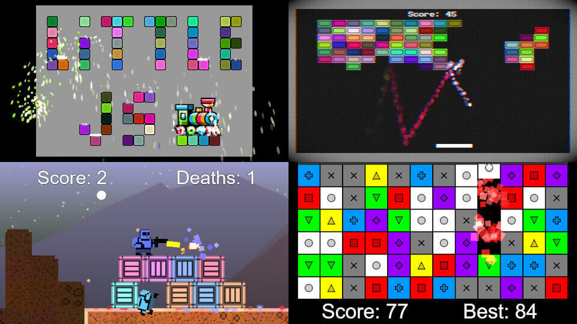

# LittleJS Engine - Special JS13k Branch

<div align='center' markdown='1'>
    

    
</div>

## 🚂 All aboard!

[LittleJS](https://github.com/KilledByAPixel/LittleJS) is a fast, lightweight, and fully open source HTML5 game engine designed for simplicity and performance. This branch is a size-optimized fork for size coding competitions like [JS13K](https://js13kgames.com/). It exists so the main line engine can keep growing while this version stays small enough to keep minifying. Many JS13K games have been made with LittleJS, including several top 10 finishers. See [the list below](#-js13k-games-made-with-littlejs).

**The starter builds to a ~7700 byte zip against the 13312 byte limit.** That is 58% of the budget with the whole engine included: WebGL rendering, physics, particles, tile layers, sound, medals and input, plus the `tiles.png` sprite sheet in the zip. Turning off features you do not use frees up about 2.5KB more. Thanks to the way compression works, the remaining 40% goes a long way!

Games written here are meant to port back to regular LittleJS after the compo. See [Migrating to main LittleJS](#-migrating-to-main-littlejs).

<div align='center' markdown='1'>
    


</div>

## 🚀 Quick start

```bash
git clone -b js13k https://github.com/KilledByAPixel/LittleJS.git
cd LittleJS
npm install
npm start
```

Open **http://localhost:8000/examples/starter/**, edit `examples/starter/game.js`, reload.

Your whole game lives in `game.js`: `engineInit` starts the engine with five callbacks (init, update, post update, render, post render), and entities are classes extending `EngineObject` that the engine updates, moves, and renders automatically. The starter shows the pattern with tiles, particles, sound, and physics in about 100 lines. **Use the [LittleJS docs](https://killedbyapixel.github.io/LittleJS/docs) as your API reference.** This branch matches the main engine's API, with the details covered in [Migrating to main LittleJS](#-migrating-to-main-littlejs).

The dev page runs the debug build: press `Esc` for the debug overlay, then `1`/`2` for physics and particle debug, and `5` for a screenshot. All debug tooling compiles out of the release zip.

When you want a compo-ready zip:

```bash
npm run build
```

That writes `examples/starter/game.zip` and prints the size against the limit, failing with a non-zero exit code if you go over.

**Use `npm start` rather than opening `index.html` directly.** Over `file://` the browser treats `tiles.png` as cross-origin, so the WebGL texture upload throws a `SecurityError` and nothing renders. `serve.js` is a dependency-free static server that exists only to avoid that. Set `PORT` to change the port.

`npm test` runs a quick headless engine smoke test. You do not need it to make a game.

**`npm run test:release` builds the zip and then drives the built page in headless Chrome**, failing on any page error or on a page that stops animating. This is the only test that looks at what you actually submit. The dev page and `npm test` both run the readable sources, so neither can see a Closure rename that broke a DOM call, a `FEATURES` strip that took too much, or an HTML shell that parses but never runs the script. Those bugs are invisible until someone opens the zip. It skips with a notice if you have no Chrome or Edge, and `CHROME_PATH` points it at any other Chromium build. Add steps to `WALK_STEPS` in [test/release.mjs](test/release.mjs) as your game grows so the walk reaches every screen.

## 🔧 How the build works

`examples/starter/build.mjs` is a plain Node script, no bundler:

| Stage | What it does |
|---|---|
| Concatenate | Joins `sourceFiles` into one file and strips CR so a CRLF checkout builds the same bytes as an LF one. No modules, everything shares one global scope. |
| Guard asserts | Short circuits every `ASSERT` and `LOG` call with `false&&` so their arguments never run. |
| Feature flags | Rewrites anything disabled in `FEATURES` to a compile time constant so the next stage can delete it. |
| Closure Compiler | `ADVANCED` mode. Renames everything and deletes every function the game never calls. |
| UglifyJS | A second `-c -m --toplevel` pass. `--toplevel` also mangles and drops top level names, worth 54 bytes. Safe here because the build inlines everything into one script that nothing external references, but if you hand-write an HTML page with its own `<script>` calling into your game, remove it. |
| Roadroller | Re-encodes the JavaScript as self-extracting compressed data. Slowest stage, biggest win. |
| Inline HTML | Wraps the payload in the smallest shell that still works: no doctype, no `<head>`, no `</body>`. |
| ect zip | Zips the inlined HTML plus `dataFiles`. This is what you submit. |

Also at the top of `build.mjs`: `DEBUG_BUILD` keeps the intermediate files so you can see what each stage produced, `USE_ROADROLLER` turns off the slow stage while iterating, and `ROADROLLER_EXTREME` passes `--optimize 2`, which takes a minute of work for a few bytes, so save it for the end.

**Asserts are guarded, not just emptied.** `ASSERT` and `LOG` are empty functions in `engineRelease.js`, but an empty function is only free if nobody evaluates what you pass it, and a call evaluates its arguments first regardless. Closure deletes the calls it can prove pure, which is most of them, but not ones like `ASSERT(!this.children.includes(child))`: it cannot know `Array.prototype.includes` has no side effect, so that scan shipped and ran on every `addChild` and `removeChild`. The build now rewrites every call to `false&&ASSERT(...)`, which is dead at parse time, worth 26 bytes and the wasted work. It counts the calls it found and fails the build if it could not rewrite all of them, so an assert written in a spelling the pattern misses stops the build instead of silently shipping. Your own `ASSERT` and `LOG` calls in `game.js` are covered too.

**`ROADROLLER_ARGS` pins the compressor.** Left empty, roadroller runs a randomized ~30 attempt parameter search on every build, so the same source packs to a different size each time. That spread was 7 bytes on the starter, which is more than most single changes are worth, and it makes A/B measurement meaningless. Once your game is roughly stable, copy the ``use `-Zab32 -Zdy0 ...` to replicate`` arguments a build prints into `ROADROLLER_ARGS`. Builds then become reproducible and every byte you see is real. Empty it and re-search after the source has moved a lot, and judge the new arguments by the zip size, not by the number the search prints.

Add your own files to `sourceFiles`, and runtime assets to `dataFiles`.

## 📦 Saving space

**[SIZECODING.md](SIZECODING.md) is the long version:** what actually made real 13,312 byte games smaller, what did not, and how to tell the difference, measured on shipped JS13K entries. It is written to be handed to an AI assistant that is hunting for bytes. This section only covers the switches already wired into the starter. Read the other one when you are close to the limit, not before.

**Start by not worrying about it.** Closure in `ADVANCED` mode already deletes every engine function your game never calls, so unused features mostly cost nothing.

It also folds away flags that default to `false` on its own: it sees the initializer, sees nothing ever writes it, and deletes the block. So `headlessMode` and `touchGamepadEnable` already cost nothing.

What it *cannot* delete is code behind a flag that defaults to `true`. The engine declares those as mutable `let` bindings so their setters work, and Closure has to keep both branches of every `if (glEnable)`. That is why the whole WebGL implementation survives in a game that never draws with it. The `FEATURES` block fixes that by rewriting a disabled flag to `const false` and emptying its setter before Closure runs:

```js
const FEATURES =
{
    webgl:   true, // WebGL renderer, disabling falls back to canvas 2D
    touch:   true, // touch input and the on screen touch gamepad
    gamepad: true, // gamepad input
    sound:   true, // all audio
    physics: true, // collision response, both object vs object and object vs tile
};
```

| Disabled | Saving | What you lose |
|---|---:|---|
| `touch` | 140 | Touch input and the on-screen touch gamepad |
| `gamepad` | 237 | Gamepad input with multiple controller support |
| `webgl` | **778** | WebGL sprite batching, rendering falls back to canvas 2D |
| `sound` | **786** | All audio: ZzFX sounds, music, and speech |
| `physics` | **477** | All collision response, object vs object and object vs tile |
| all five | **~2500** | A silent keyboard-and-mouse game drawn with canvas 2D |

Around 2.5KB, roughly 19% of the budget, for a silent keyboard-and-mouse game. Disabling `physics` removes the automatic collision response including tile bouncing, but query functions you call yourself, like `tileCollisionTest` or `getTileCollisionData`, always survive because your game references them.

Two things worth knowing:

- **Setting `glEnable = false` in your own code costs 50 bytes instead of saving any.** The flag is still mutable, and you have added an assignment. Use `FEATURES`.
- **`FEATURES` only affects the built zip.** `npm start` loads `src/` directly, so the dev page always has everything on. To develop against what you ship, call the setter in `gameInit`. `setGLEnable(false)` compiles to nothing in the build.

Beyond that you can delete an unused engine file from `sourceFiles`, but the saving comes from your game not using the feature, not from deleting the file: once Closure sees `ParticleEmitter` is unreachable it removes all of it, and dropping the file afterwards gains nothing. The exception is `engineTileLayer.js`, which leaves a 72 byte residue because `engineObject.js` calls `tileCollisionTest` inside `if (this.collideTiles)`. Disabling `physics` compiles that reference out too, so the residue disappears with it. Nothing warns you if you remove a file something still references, you just get a `ReferenceError` at runtime instead of a build error.

**The HTML shell is already as small as it can safely get.** There is no doctype, no `<head>`, and no `</body>`, which the parser all infers, and that is worth 19 bytes. Quirks mode is harmless here because the engine sizes the canvas from `innerWidth`/`innerHeight`, which quirks mode does not change. Two pieces are load bearing and should stay: `</script>` (a script left open at end of file is never executed at all, so dropping it produces a smaller zip that does nothing) and the viewport meta (without it phones lay the page out at 980px and scale the result down). The viewport meta costs 41 bytes, which is the most expensive line in the shell, but it is the difference between a game that looks right on a phone and one that does not.

**Put back any 2D context state you change.** The engine only assigns `mainCanvas.width` when the size actually changes, because assigning it reallocates the canvas and makes the browser rebuild the page, which was a real bottleneck on some machines. That assignment used to be what cleared the canvas *and* reset the 2D context every frame, so it was quietly undoing any transform, blend mode or alpha you left set. It no longer runs every frame, and restoring all of that by hand cost 36 bytes for something a game should be doing anyway, so the engine does not do it. If you call `setAdditiveBlendMode(true)`, apply a transform, or set `globalAlpha`, set it back when you are done. The dev build asserts on all three at the end of every frame and names the one you left set, and the whole check compiles out of the release, so this costs nothing to have.

**Setting `PROGRAM_TITLE = ''` drops the `<title>` and saves 28 bytes.** Nothing on the JS13K site shows it, so this is nearly free if you are not also publishing the game somewhere it gets its own tab. The dev page keeps its title either way.

Finally: every entry in `dataFiles` goes in the zip. `tiles.png` is already PNG-compressed so `ect` can only shave a little. Shrinking the image or generating art procedurally is often the cheapest win left.

Numbers in this section were measured on the starter with `ROADROLLER_ARGS` pinned. Yours will differ. That is the whole point of [SIZECODING.md](SIZECODING.md): build it, then decide.

## 🔀 Migrating to main LittleJS

Build during the compo here, port to regular LittleJS after. **Use the [regular LittleJS docs](https://killedbyapixel.github.io/LittleJS/docs) as your API reference.** The names, argument orders, and defaults match, and anything not listed below behaves the same. This list is meant to be enough to do the whole conversion from, including by an AI assistant given only this section.

Verified name by name against **LittleJS 1.18.25**. Anything in `main` that does not exist here (plugins, `CanvasLayer`, pointer lock, ...) is purely additive. A game written here cannot be using it, so it simply becomes available on port.

### Tile collision

This branch has a single global collision grid instead of `main`'s `TileCollisionLayer` objects. Converting is a simple find and replace:

```js
// here
initTileCollision(vec2(w, h));
setTileCollisionData(pos, data);
getTileCollisionData(pos);
const layer = new TileLayer(pos, size);

// main, the layer handles visuals and collision as one object
const layer = new TileCollisionLayer(pos, size);
layer.setCollisionData(pos, data);
layer.getCollisionData(pos);
```

Everything else about tiles ports unchanged: `TileLayer` takes `(position, size, tileInfo, renderOrder)` in both, and `tileCollisionTest` / `tileCollisionRaycast` have the same signatures and return the same hit points. One nuance: `tileCollisionTest` returns a `Boolean` here and the hit layer (or `undefined`) in `main`, so truthiness tests port fine but `=== true` does not.

### Sound instances

`sound.play()` returns the raw `AudioBufferSourceNode` here; in `main` it returns a `SoundInstance` object with its own playback controls. The `Sound` methods that act on the most recently played instance here (`stop()`, `setVolume()`, `getSource()`) do not exist on `Sound` in `main`. Keep the return value of `play()` and call them on that instead:

```js
// here
const source = sound.play(pos);
sound.setVolume(.5);
sound.stop();

// main
const instance = sound.play(pos);
instance.setVolume(.5);
instance.stop(fadeTime); // optional fade out
```

`SoundInstance` also adds `pause()` / `resume()` / `isPlaying()` and friends, which have no equivalent here.

### Behavior differences

- **Particles are `EngineObject`s here**, updated by the engine like everything else; in `main` they are lightweight objects owned and updated by their emitter. The `ParticleEmitter` API is the same in both, but per-particle physics tweaks made in `particleCreateCallback` (like changing one particle's `damping`) become emitter-level settings on port.
- **`inputPreventDefault` covers less here.** It only suppresses middle/right mouse clicks, while `main` also uses it to prevent arrow keys, space, and tab from scrolling or refocusing the page, and to guard touch `preventDefault` (always on here).
- **`Vector2.toString()` and `Timer.toString()` are debug-only here.** They format on the dev page but return `undefined` in the built zip, since `toString` is the one method name Closure cannot delete, so the body is stripped instead. `Color.toString()` works everywhere. In `main` they always format.
- **`ImageFont` draws untinted canvas 2d here.** The `color` and `useWebGL` arguments are accepted but ignored, so a color passed here silently starts applying after the port. The no-argument built-in 8x8 font is also js13k-only; `main` requires a `tileInfo`. Fonts passed as a `tileInfo` work the same in both.
- **The 2D context is not reset for you here.** `main` restores the transform and blend mode every frame; this branch does not, to save the bytes, and asserts in the dev build instead. A game written here therefore already puts back what it sets, so it ports to `main` unchanged. Going the other way, code that relied on `main` cleaning up after it needs the matching reset added.

### Version

`engineVersion` is `1.18.25-js13k`, the mainline release this branch's API is aligned with and the migration notes are verified against. The branch does not track mainline release for release; it takes fixes, renames, and structural changes selectively when they do not cost bytes, and skips the large `engineDraw` / `engineInput` / `engineWebGL` feature growth and the plugin system.

Main was reviewed again through **1.19.4** (September 2026) and the fixes that were free were taken: the `speak` volume overflow, decoded sound samples used without a copy, and the paused update rate. One that was not free was taken anyway, for 25 bytes: only resizing the canvas when its size changes, since resizing every frame was a real bottleneck on some machines. Deliberately not taken, because each adds bytes to always-running code for performance or features this branch does not have: the 3D plugins and their collision work, `Shader`, `SpriteAnimation`, `AudioEffect` and the master effect chain, `SoundInstance` playback controls, shared audio buffers, device pixel ratio support, and skipping renders when nothing changed. The API is still aligned to 1.18.25, so the migration notes above stand.

## 📏 [Size Coding for JS13K](SIZECODING.md)
## 💥 [Live Demo of Starter Project](https://killedbyapixel.github.io/LittleJS/examples/starter)
## 🛠️ [Main LittleJS Repo](https://github.com/KilledByAPixel/LittleJS)
## 🧙 [LittleJS13k Wizard](https://github.com/eoinmcg/create-js13k-littlejs) by [eoinmcg](https://github.com/eoinmcg)

## 🎮 JS13K games made with LittleJS

- [Space Huggers](https://js13kgames.com/2021/games/space-huggers) - Roguelike platformer shoot-em-up game with procedural levels. by KilledByAPixel
- [Black Cat Squadron](https://js13kgames.com/games/black-cat-squadron) - One button shooter based on a WW2 Navy squadron. by repsej
- [L1ttL3 Paws](https://js13kgames.com/2025/games/l1ttl3-paws) - Cat glider with procedural art and levels. by Frank Force
- [The Way of the Dodo](https://js13kgames.com/2024/games/the-way-of-the-dodo) - Single button flapping platformer. by repsej
- [KleptoKitty](https://js13kgames.com/games/kleptokitty) - Cat themed heist puzzle. by eoinmcg
- [Wendol Village](https://js13kgames.com/games/wendol-village) - Warcraft inspired RTS game. by sanojian
- [Dead Again](https://js13kgames.com/games/dead-again) - Top down survival horror. by sanojian & repsej
