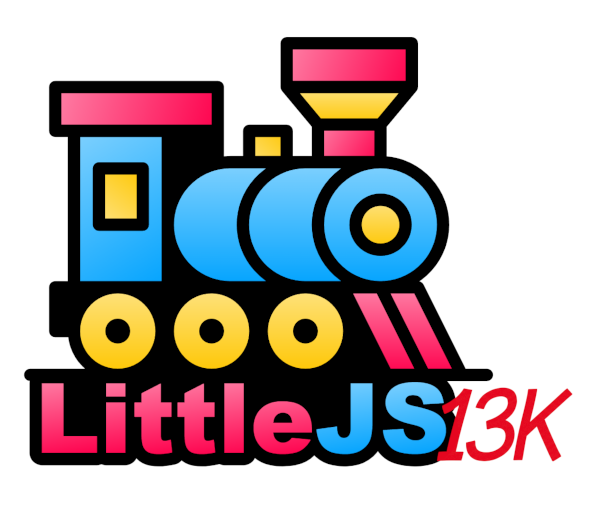

# LittleJS Engine - Special Js13k Branch

<div align="center">



</div>

## 🚂 All aboard!

LittleJS is a fast, lightweight, and fully open source HTML5 game engine designed for simplicity and performance. Its small footprint is packed with a comprehensive feature set including rendering, physics, particles, sound, and input handling. The code is very clean and well documented with many examples to get you started quickly.

## 🤝 Js13k + LittleJS

A size-optimized fork of LittleJS for size coding competitions like [JS13K](https://js13kgames.com/). It exists so the main line engine can keep growing while this version stays small enough to keep minifying.

**The starter builds to a ~7735 byte zip against the 13312 byte limit** — 57% of the budget, with the whole engine included: WebGL rendering, physics, particles, tile layers, sound, medals and input. Turning off features you do not use frees up nearly 2KB more.

Games written here are meant to port back to regular LittleJS after the compo — see [Migrating to main LittleJS](#-migrating-to-main-littlejs).

## 🚀 Quick start

```bash
git clone -b js13k https://github.com/KilledByAPixel/LittleJS.git
cd LittleJS
npm install
npm start
```

Open **http://localhost:8000/examples/starter/**, edit `examples/starter/game.js`, reload. When you want a compo-ready zip:

```bash
npm run build
```

That writes `examples/starter/game.zip` and prints the size against the limit, failing with a non-zero exit code if you go over.

**Use `npm start` rather than opening `index.html` directly** — over `file://` the browser treats `tiles.png` as cross-origin, so the WebGL texture upload throws a `SecurityError` and nothing renders. `serve.js` is a dependency-free static server that exists only to avoid that. Set `PORT` to change the port.

`npm run build:engine` generates the `dist/` bundles and TypeScript definitions. You do not need it to make a game.

## 🔧 How the build works

`examples/starter/build.mjs` is a plain Node script, no bundler:

| Stage | What it does |
|---|---|
| Concatenate | Joins `sourceFiles` into one file. No modules — everything shares one global scope. |
| Feature flags | Rewrites anything disabled in `FEATURES` to a compile time constant so the next stage can delete it. |
| Closure Compiler | `ADVANCED` mode. Renames everything and deletes every function the game never calls. |
| UglifyJS | A second `-c -m --toplevel` pass. `--toplevel` also mangles and drops top level names, worth 54 bytes. Safe here because the build inlines everything into one script that nothing external references — but if you hand-write an HTML page with its own `<script>` calling into your game, remove it. |
| Roadroller | Re-encodes the JavaScript as self-extracting compressed data. Slowest stage, biggest win. |
| ect zip | Zips the inlined HTML plus `dataFiles`. This is what you submit. |

Also at the top of `build.mjs`: `DEBUG_BUILD` keeps the intermediate files so you can see what each stage produced, `USE_ROADROLLER` turns off the slow stage while iterating, and `ROADROLLER_EXTREME` passes `--optimize 2` (a minute of work for a few bytes — save it for the end).

Add your own files to `sourceFiles`, and runtime assets to `dataFiles`.

## 📦 Saving space

**Start by not worrying about it.** Closure in `ADVANCED` mode already deletes every engine function your game never calls, so unused features mostly cost nothing.

It also folds away flags that default to `false` on its own: it sees the initializer, sees nothing ever writes it, and deletes the block. So `showSplashScreen` and `headlessMode` already cost nothing.

What it *cannot* delete is code behind a flag that defaults to `true`. The engine declares those as mutable `let` bindings so their setters work, and Closure has to keep both branches of every `if (glEnable)` — which is why the whole WebGL implementation survives in a game that never draws with it. The `FEATURES` block fixes that by rewriting a disabled flag to `const false` and emptying its setter before Closure runs:

```js
const FEATURES =
{
    webgl:   true, // WebGL renderer, disabling falls back to canvas 2D
    touch:   true, // touch input and the on screen touch gamepad
    gamepad: true, // gamepad input
    sound:   true, // all audio
    physics: true, // object vs object collision, tile collision still works
};
```

| Disabled | Saving |
|---|---:|
| `touch` | 154 |
| `gamepad` | 254 |
| `webgl` | **733** |
| `sound` | **808** |
| `physics` | **554** |
| all five | **~2500** |

Around 2.5KB, roughly 19% of the budget, for a silent keyboard-and-mouse game that only needs tile collision.

Two things worth knowing:

- **Setting `glEnable = false` in your own code costs 50 bytes instead of saving any** — the flag is still mutable, and you have added an assignment. Use `FEATURES`.
- **`FEATURES` only affects the built zip.** `npm start` loads `src/` directly, so the dev page always has everything on. To develop against what you ship, call the setter in `gameInit` — `setGLEnable(false)` compiles to nothing in the build.

Beyond that you can delete an unused engine file from `sourceFiles`, but the saving comes from your game not using the feature, not from deleting the file: once Closure sees `ParticleEmitter` is unreachable it removes all of it, and dropping the file afterwards gains nothing. The exception is `engineTileLayer.js`, which leaves a 72 byte residue because `engineObject.js` calls `tileCollisionTest` inside `if (this.collideTiles)`. Nothing warns you if you remove a file something still references — you get a `ReferenceError` at runtime, not a build error.

Finally: every entry in `dataFiles` goes in the zip. `tiles.png` is already PNG-compressed so `ect` can only shave a little — shrinking the image, or generating art procedurally, is often the cheapest win left.

## 🔀 Migrating to main LittleJS

Build during the compo here, port to regular LittleJS after. **Use the [regular LittleJS docs](https://killedbyapixel.github.io/LittleJS/docs) as your API reference** — the names, argument orders, and defaults match, and anything not listed below behaves the same. This list is meant to be enough to do the whole conversion from, including by an AI assistant given only this section.

Verified name by name against **LittleJS 1.18.25**. Anything in `main` that does not exist here (plugins, `CanvasLayer`, `ImageFont`, pointer lock, ...) is purely additive — a game written here cannot be using it, so it simply becomes available on port.

### Tile collision

This branch has a single global collision grid instead of `main`'s `TileCollisionLayer` objects. Converting is a simple find and replace:

```js
// here                                    // main
initTileCollision(vec2(w, h));             const layer = new TileCollisionLayer(pos, size);
setTileCollisionData(pos, data);           layer.setCollisionData(pos, data);
getTileCollisionData(pos);                 layer.getCollisionData(pos);
const layer = new TileLayer(pos, size);    // visuals and collision are the same object
```

Everything else about tiles ports unchanged — `TileLayer` takes `(position, size, tileInfo, renderOrder)` in both, and `tileCollisionTest` / `tileCollisionRaycast` have the same signatures and return the same hit points. One nuance: `tileCollisionTest` returns a `Boolean` here and the hit layer (or `undefined`) in `main`, so truthiness tests port fine but `=== true` does not.

### Sound instances

`sound.play()` returns the raw `AudioBufferSourceNode` here; in `main` it returns a `SoundInstance` object with its own playback controls. The `Sound` methods that act on the most recently played instance here — `stop()`, `setVolume()`, `getSource()` — do not exist on `Sound` in `main`. Keep the return value of `play()` and call them on that instead:

```js
// here                                    // main
const source = sound.play(pos);            const instance = sound.play(pos);
sound.setVolume(.5);                       instance.setVolume(.5);
sound.stop();                              instance.stop(fadeTime); // optional fade out
```

`SoundInstance` also adds `pause()` / `resume()` / `isPlaying()` and friends, which have no equivalent here.

### Behavior differences

- **Particles are `EngineObject`s here**, updated by the engine like everything else; in `main` they are lightweight objects owned and updated by their emitter. The `ParticleEmitter` API is the same in both, but per-particle physics tweaks made in `particleCreateCallback` (like changing one particle's `damping`) become emitter-level settings on port.
- **`inputPreventDefault` covers less here** — it only suppresses middle/right mouse clicks, while `main` also uses it to prevent arrow keys, space, and tab from scrolling or refocusing the page, and to guard touch `preventDefault` (always on here).

### Version

`engineVersion` is `1.13.1-js13k` — the release the source is *derived from*, not the current upstream (1.18.25). The gap is deliberate: this branch does not track mainline release for release, it takes fixes, renames and structural changes selectively when they do not cost bytes. The migration notes above are current regardless, verified against 1.18.25.

Not taken from upstream: the large `engineDraw` / `engineInput` / `engineWebGL` feature growth, and the plugin system.

## 💥 [Live Demo of Starter Project](https://killedbyapixel.github.io/LittleJS/examples/starter)
## 🛠️ [Main LittleJS Repo](https://killedbyapixel.github.io/LittleJS)
## 🧙 [LittleJS13k Wizard](https://github.com/eoinmcg/create-js13k-littlejs) by [eoinmcg](https://github.com/eoinmcg)

## 🎮 JS13K games made with LittleJS

Many amazing JS13K games have been made using LittleJS, including a few in the top 10...

- [Space Huggers](https://js13kgames.com/2021/games/space-huggers) - Roguelike platformer shoot-em-up game with procedural levels. by KilledByAPixel
- [Black Cat Squadron](https://js13kgames.com/games/black-cat-squadron) - One button shooter based on a WW2 Navy squadron. by repsej
- [L1ttL3 Paws](https://js13kgames.com/2025/games/l1ttl3-paws) - Cat glider with procedural art and levels. by Frank Force
- [The Way of the Dodo](https://js13kgames.com/2024/games/the-way-of-the-dodo) - Single button flapping platformer. by repsej
- [KleptoKitty](https://js13kgames.com/games/kleptokitty) - Cat themed heist puzzle. by eoinmcg
- [Wendol Village](https://js13kgames.com/games/dead-again) - Warcraft inspired RTS game. by sanojian
- [Dead Again](https://js13kgames.com/games/dead-again) - Top down survival horror. by sanojian & repsej
