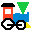

# LittleJS Engine Quick Reference Sheet

##  This cheat sheet contains all LittleJS essentials.
- [LittleJS on GitHub](https://github.com/KilledByAPixel/LittleJS) - Official LittleJS website with more info
- [LittleJS Documentation](https://killedbyapixel.github.io/LittleJS/docs) - LittleJS documentation browser
- [Particle System Designer](https://killedbyapixel.github.io/LittleJS/examples/particles) - Editor for LittleJS Particle Systems
- [Sound Effect Designer](https://killedbyapixel.github.io/ZzFX) - Tool for creating ZzFX sound effects
- [Starter Project](https://killedbyapixel.github.io/LittleJS/examples/starter) - Simple LittleJS demo  to start with

## LittleJS Setup

To start LittleJS, you need to create a few functions and pass them to engineInit.

```javascript
// Start up LittleJS engine with your callback functions
engineInit(init, update, updatePost, render, renderPost, imageSources=['tiles.png']);
```

## LittleJS Utilities Classes and Functions
- General purpose math library
- Vector2 - Fast, simple, easy 2D vector class
- Color - Holds a rgba color with some math functions
- Timer - Tracks time automatically
- RandomGenerator - Seeded random number generator

```javascript

// Object Constructors
vec2(x=0, y=x)                                // Create a 2D vector with Vector or floats
rgb(r=1, g=1, b=1, a=1)                       // Create a color object with RGBA values
hsl(h=0, s=0, l=1, a=1)                       // Create a color object with HSLA values
tile(pos=(0,0), size, textureIndex=0)         // Create a tile info object

// Helper functions 
abs(value)                                    // Get absoulte value
min(valueA, valueB)                           // Get lowest of values
max(valueA, valueB)                           // Get highest of values
sign(value)                                   // Get the sign of value
mod(dividend, divisor=1)                      // Get remainder of division
clamp(value, min=0, max=1)                    // Clamps between values
percent(value, valueA, valueB)                // Get percentage between values
lerp(percent, valueA, valueB)                 // Linearly interpolates between values
distanceWrap(valueA, valueB, wrapSize=1)      // Signed wrapped distance between values
lerpWrap(percent, valueA, valueB, wrapSize=1) // Linearly interpolates with wrapping
distanceAngle(angleA, angleB)                 // Signed wrapped distance between angles
lerpAngle(percent, angleA, angleB)            // Linearly interpolates with wrapping
smoothStep(percent)                           // Applies smoothstep function
nearestPowerOfTwo(value)                      // Returns the nearest power of two
isOverlapping(pointA, sizeA, pointB, sizeB)   // Checks if bounding boxes overlap
isIntersecting(start, end, pos, size)         // Checks if ray intersects box
wave(frequency=1, amplitude=1, t=time)        // Returns oscillating wave
formatTime(t)                                 // Formats seconds for display 

// Random functions
rand(valueA=1, valueB=0)             // Random float between values
randInt(valueA, valueB=0)            // Random integer between values
randSign()                           // Randomly bool either -1 or 1
randVector(length=1)                 // Random Vector2 with the passed in length
randInCircle(radius=1, minRadius=0)  // Random Vector2 within a circle
randColor(colorA, colorB, linear)    // Random color between values

// 2D vector math
Vector2(x=0, y=0)                         // Create a 2D vector
Vector2.copy()                            // Copy this vector    
Vector2.add(v)                            // Add a vector
Vector2.subtract(v)                       // Subtract a vector
Vector2.multiply(v)                       // Multiply by a vector 
Vector2.divide(v)                         // Divide by a vector
Vector2.scale(s)                          // Scale by a float
Vector2.length()                          // Get length 
Vector2.lengthSquared()                   // Get length squared
Vector2.distance(v)                       // Get distance to vector
Vector2.distanceSquared(v)                // Get distance to vector squared
Vector2.normalize(length=1)               // Normalize this vector to length
Vector2.clampLength(length=1)             // Clamp this vector to length
Vector2.dot(v)                            // Dot product with vector
Vector2.cross(v)                          // Cross product with vector
Vector2.invert()                          // Invert this vector
Vector2.floor()                           // Floor this vector
Vector2.area()                            // Get area covered by this vector as a rectangle
Vector2.lerp(v, percent)                  // Interpolate between vectors
Vector2.arrayCheck(arraySize)             // Check if in bounds of array size
Vector2.angle()                           // Angle of this vector, up is 0
Vector2.setAngle(angle=0, length=1)       // Set angle and length
Vector2.rotate(angle)                     // Rotate by angle
Vector2.setDirection(direction, length=1) // Set integer direction (0-3) and length
Vector2.direction()                       // Get integer direction (0-3)
Vector2.toString(digits=3)                // Get string representation

// RGBA color object
Color(r=1, g=1, b=1, a=1)                 // Create an RGBA color
Color.copy()                              // Copy this color
Color.add(c)                              // Add a color
Color.subtract(c)                         // Subtract a color
Color.multiply(c)                         // Multiply by a color
Color.divide(c)                           // Divide by a color
Color.scale(scale, alphaScale=scale)      // Scale by a float
Color.clamp()                             // Clamp this color
Color.lerp(c, percent)                    // Interpolate between colors
Color.setHSLA(h=0, s=0, l=1, a=1)         // Set the color from HSLA values
Color.HSLA()                              // Get the color in HSLA format
Color.mutate(amount=.05, alphaAmount=0)   // Randomly diverge from this color
Color.setHex(hex)                         // Set this color from a hex code
Color.rgbaInt()                           // Get this color as 32 bit RGBA value
Color.toString(useAlpha=true)             // Get hex color code as a string

// Seeded random number generator
RandomGenerator(seed)                     // Create a random number generator
RandomGenerator.float(valueA=1, valueB=0) // Random float between values
RandomGenerator.int(valueA, valueB=0)     // Random integer between values
RandomGenerator.sign()                    // Randomly either -1 or 1

// Time tracking system
Timer(timeLeft)        // Create a timer object
Timer.set(timeLeft=0)  // Set the timer with seconds passed in
Timer.unset()          // Unset the timer
Timer.isSet()          // Returns true if set
Timer.active()         // Returns true if set and has not elapsed
Timer.elapsed()        // Returns true if set and elapsed
Timer.get()            // Get how long since elapsed, 0 if not set
Timer.getPercent()     // Get percent elapsed, 0 if not set
Timer.toString()       // Get this timer expressed as a string
Timer.valueOf()        // Get how long since elapsed, 0 if not set
```

## LittleJS Drawing System
- Hybrid system with both Canvas2D and WebGL available
- Super fast tile sheet rendering with WebGL
- Can apply rotation, mirror, color and additive color
- Text and font rendering system with built in engine font

```javascript
// Drawing functions
drawTile(pos, size=(1,1), tileInfo, color, angle=0, mirror, additiveColor)
drawRect(pos, size=(1,1), color=(1,1,1,1), angle=0)
drawLine(posA, posB, thickness=.1, color=(1,1,1,1))
drawCanvas2D(pos, size, angle, mirror, drawFunction)
drawText(text, pos, size=1, color=(1,1,1,1), lineWidth, lineColor)
drawTextScreen(text, pos, size=1, color=(1,1,1,1), lineWidth, lineColor)
setBlendMode(additive)
toggleFullscreen()
isFullscreen()

// Tile Info Object
TileInfo(pos=(0,0), size, textureIndex=0) // Create a tile info object
TileInfo.pos              // Top left corner of tile in pixels
TileInfo.size             // Size of tile in pixels
TileInfo.textureIndex     // Texture index to use
TileInfo.offset(offset)   // Offset this tile by a certain amount in pixels
TileInfo.frame(frame)     // Offset this tile by a number of animation frames
TileInfo.getTextureInfo() // Returns texture info for this tile

// Texture Info Object
TextureInfo(image)       // Created automatically for each image
TextureInfo.image        // Image source
TextureInfo.size         // Size of the image
TextureInfo.glTexture    // WebGL texture

// Font Image Object draws text using characters in an image
FontImage(image, tileSize=(8,8), paddingSize=(0,1)) // Create an image font
FontImage.drawText(text, pos, scale, center)        // Draw text in world space
FontImage.drawTextScreen(text, pos, scale, center)  // Draw text in screen space

// Camera settings
cameraPos = (0,0)        // Position of camera in world space
cameraScale = 32         // Scale of camera in world space
screenToWorld(screenPos) // Convert from screen to world space coordinates
worldToScreen(worldPos)  // Convert from world to screen space coordinates
getCameraSize()          // Get the camera's visible area in world space

// Display settings
canvasMaxSize = (1920, 1200)  // The max size of the canvas
canvasFixedSize = (0, 0)      // Fixed size of the canvas
fontDefault = 'arial'         // Default font used for text rendering
canvasPixelated = true        // Disable filtering for crisper pixel art?
showSplashScreen = false      // Show the LittleJS splash screen on startup?
glEnable = true               // Enable fast WebGL rendering?
glOverlay = true              // Prevent compositing the WebGL canvas?
```

## LittleJS Audio System
- Caches sounds and music for fast playback
- Can attenuate and apply stereo panning to sounds
- Ability to play mp3, ogg, and wave file
- [ZzFX Sound Effect Generator](https://killedbyapixel.github.io/ZzFX)
- [ZzFXM Music System](https://keithclark.github.io/ZzFXM)

```javascript
// Sound Object
Sound(zzfxSound)                                        // Create a zzfx sound
SoundWave(filename, randomness=0)                       // Load a wave, mp3, and ogg
Sound.play(pos, volume=1, pitch=1, randomness=1, loop)  // Play a sound
Sound.playNote(semitoneOffset, pos, volume=1)           // Play as note with a semitone offset
Sound.stop()                                            // Stop the last instance that was played
Sound.getSource()                                       // Get source of most recent instance
Sound.getDuration()                                     // Get length of sound in seconds
Sound.isLoading()                                       // Check if sound is loading

// ZzFXM - A tiny music system
Music(..zzfxMusic)                                      // Create a zzfx music object
Music.playMusic(volume, loop=false)                     // Play the music

// Audio functions
playAudioFile(filename, volume=1, loop=false)           // Play an audio file or url
speak(text, language='', volume=1, rate=1, pitch=1)     // Speak text line
speakStop()                                             // Stop all queued speech

// Audio settings
soundEnable = true      // Should sound be enabled?
soundVolume = .5        // Volume scale to apply to all sound
soundDefaultRange = 40  // Default range where sound no longer plays
soundDefaultTaper = .7  // Default range percent to taper off sound (0-1)
```

## LittleJS Input System
- Tracks keyboard down, pressed, and released
- Tracks mouse buttons, position, and wheel
- Tracks multiple analog gamepads
- Routes touch input to mouse
- Virtual gamepad for touch devices

```javascript
// Keyboard
keyIsDown(key)                        // Is key down?
keyWasPressed(key)                    // Was key pressed this frame?
keyWasReleased(key)                   // Was key released this frame?

// Mouse / Touch
mousePos                              // World space mouse position
mousePosScreen                        // Screen space mouse position
mouseWheel                            // Delta mouse wheel this frame    
mouseIsDown(button)                   // Is mouse button down?
mouseWasPressed(button)               // Was mouse button pressed this frame?
mouseWasReleased(button)              // Was mouse button released this frame?

// Gamepad
isUsingGamepad                        // Is user currently using gamepad?
gamepadIsDown(button, gamepad=0)      // Is gamepad button down?
gamepadWasPressed(button, gamepad=0)  // Was gamepad button pressed this frame?
gamepadWasReleased(button, gamepad=0) // Was gamepad button released this frame?
gamepadStick(stickIndex, gamepad=0)   // Get gamepad analog stick value

// Touch Gamepad
touchGamepadEnabled                   // Is on screen touch gamepad enabled?
touchGamepadAnalog                    // Is touch gamepad analog or 8 way dpad?
touchGamepadSize                      // Size of touch gamepad
touchGamepadAlpha                     // Alpha of touch gamepad

// Vibration
vibrate(pattern=100)                  // Pulse the vibration hardware if it exists
vibrateStop()                         // Stop all vibration

// Input settings
gamepadsEnable = true                 // Should gamepads be allowed?
gamepadDirectionEmulateStick = true   // Should dpad be routed to the left analog stick?
inputWASDEmulateDirection = true      // Should WASD keys be routed to the direction keys?
vibrateEnable = true                  // Allow vibration hardware if it exists?
touchGamepadEnable = false            // Should touch gamepad appear on mobile devices?
touchGamepadAnalog = true             // Should touch gamepad be analog or 8 way dpad?
touchGamepadSize = 99                 // Size of virtual gamepad for touch devices
touchGamepadAlpha = .3                // Transparency of touch gamepad overlay
```

## LittleJS Object System
- Top level object class used by the engine
- Automatically adds self to object list
- Will be updated and rendered each frame
- Renders as a sprite from a tile sheet by default
- Can have color and addtive color applied
- 2D Physics and collision system
- Sorted by renderOrder before drawing
- Objects can have children in local space
- Parents are updated before children
- Call destroy() to get rid of objects

```javascript
// Engine Object
EngineObject(pos=(0,0), size=(1,1), tileInfo, angle=0, color, renderOrder=0)
EngineObject.update()                              // Update object, called automatically
EngineObject.render()                              // Render object, called automatically
EngineObject.destroy()                             // Destroy this object and children
EngineObject.collideWithTile(tileData, pos)        // Tile collision resolve check
EngineObject.collideWithObject(object)             // Object collision resolve check
EngineObject.getAliveTime(object)                  // How long since object was created
EngineObject.applyAcceleration(acceleration)       // Apply acceleration
EngineObject.applyForce(force)                     // Apply force
EngineObject.getMirrorSign()                       // Get mirror direction (1 or -1)
EngineObject.addChild(child, localPos, localAngle) // Attach a child
EngineObject.removeChild(child)                    // Remove a child
EngineObject.setCollision(solids, isSolid, tiles)  // Set collision

// Engine Object Members
EngineObject.pos           // World space position
EngineObject.size          // World space width and height
EngineObject.drawSize      // Size of object used for drawing if set
EngineObject.tileInfo      // Tile info to render object
EngineObject.angle         // Rotation angle for rendering
EngineObject.color         // Color to apply when rendered
EngineObject.additiveColor // Additive color to apply when rendered
EngineObject.mirror        // Should it flip along y axis when rendered
EngineObject.mass          // Weight of object, static if 0
EngineObject.damping       // How much to slow velocity each frame (0-1)
EngineObject.angleDamping  // How much to slow rotation each frame (0-1)
EngineObject.elasticity    // How bouncy is it when colliding (0-1)
EngineObject.friction      // How much friction when sliding (0-1)
EngineObject.gravityScale  // How much to scale gravity by
EngineObject.renderOrder   // Objects are sorted by render order
EngineObject.velocity      // Velocity of the object
EngineObject.angleVelocity // Angular velocity of the object

// Engine Object settings
enablePhysicsSolver = true    // Enable collisions between objects?
objectDefaultMass = 1         // Default object mass for collisions
objectDefaultDamping = 1      // How much to slow velocity by each frame (0-1)
objectDefaultAngleDamping = 1 // How much to slow angular velocity each frame (0-1)
objectDefaultElasticity = 0   // How much to bounce when a collision occurs (0-1)
objectDefaultFriction = .8    // How much to slow when touching (0-1)
objectMaxSpeed = 1            // Clamp max speed to avoid fast objects missing collisions
gravity = 0                   // How much gravity to apply to objects

// Engine Object functions
engineObjectsCollect(pos, size, objects=engineObjects)k
engineObjectsCallback(pos, size, callbackFunction, objects=engineObjects)
engineObjectsRaycast(start, end, objects=engineObjects)
engineObjectsDestroy()
```

## LittleJS Tile Layer System
- Caches arrays of tiles to off screen canvas for fast rendering
- Unlimited numbers of layers, allocates canvases as needed
- Interfaces with EngineObject for collision
- Collision layer is separate from visible layers
- It is recommended to have a visible layer that matches the collision
- Tile layers can be drawn to using their context with Canvas2d
- Drawn directly to the main canvas without using WebGL

```javascript
// Tile Collision System
tileCollisionSize                              // Size of the tile collision layer
initTileCollision(size)                        // Clear and initialize tile collision
setTileCollisionData(pos, data=0)              // Set tile collision data at pos
getTileCollisionData(pos)                      // Get tile collision data at pos
tileCollisionTest(pos, size=(0,0), object)     // Check if collision should occur
tileCollisionRaycast(posStart, posEnd, object) // Return the center of tile if hit

// Tile Layer Object
TileLayer(position, size, tileInfo, scale)     // Create a tile layer object
TileLayer.setData(layerPos, data, redraw)      // Set data at position
TileLayer.getData(layerPos)                    // Get data at position
TileLayer.redraw()                             // Draw to an offscreen canvas
TileLayer.drawTileData(layerPos, clear=true)   // Draw the tile
TileLayer.drawRect(pos, size, color, angle)    // Draw a rectangle to 2D canvas
TileLayer.drawTile(pos, size=(1,1), tileInfo, color, angle, mirror) // Draw tile
TileLayer.drawCanvas2D(pos, size, angle, mirror, drawFunction)      // Draw to 2D canvas

// Tile Layer Data Object
TileLayerData(tile, direction=0, mirror=false, color=(1,1,1,1)) // Create tile data object
TileLayerData.clear()      // Clear this tile data

// Tile sheet settings
tileSizeDefault = (16,16)  // Default size of tiles in pixels
tileFixBleedScale = .3     // How much smaller to draw tiles to prevent bleeding
```

## LittleJS Particle System
- Simple kinematic particle system with many parameters
- [Particle Effect Designer](https://killedbyapixel.github.io/LittleJS/examples/particles) - Editor for creating LittleJS Particle Systems

```javascript
// Particle Emitter Object
ParticleEmitter(position, angle, ...settings) // Create a particle system
ParticleEmitter.emitParticle()                // Spawn one particle

// Particle Settings
particleEmitRateScale = 1 // Scales particles emit rate
```

## LittleJS Debugging System
- Press Escape key to toggle debug overlay
- Number keys toggle debug functions
- +/- keys apply time scale to update
- Debug primitive rendering system
- Debug functions are only active in debug builds

```javascript
ASSERT(assert, output) // Asserts if the expression is false
debugRect(pos, size, color='#fff', time=0, angle=0, fill)   // Draw debug rectangle
debugCircle(pos, radius, color='#fff', time=0, fill)        // Draw debug circle
debugPoint(pos, color, time, angle)                         // Draw debug point
debugLine(posA, posB, color, thickness=.1, time)            // Draw debug line
debugText(text, pos, size=1, color='#fff', time=0, angle=0) // Draw debug text
debugAABB(pA, sA, pB, sB, color)     // Draw a debug axis aligned box
debugClear()                         // Clear all debug primitives
debugSaveCanvas(canvas, filename)    // Save canvas to a file
debugSaveText(text, filename)        // Save text to a file 
debugSaveDataURL(dataURL, filename)  // Save url to a file

// Debug settings
debug                // Is debug enabled?
debugPointSize = .5  // Size to render debug points by default
debugKey = 'Escape'  // Key code used to toggle debug mode
debugOverlay         // True if the debug overlay is active
enableAsserts        // True if asserts are enabled
showWatermark        // True if watermark with FPS should be show
```

[LittleJS Engine](https://github.com/KilledByAPixel/LittleJS) Copyright 2021 Frank Force


